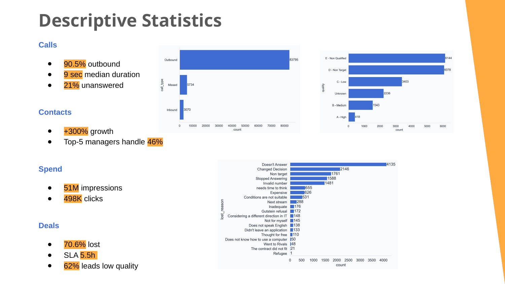
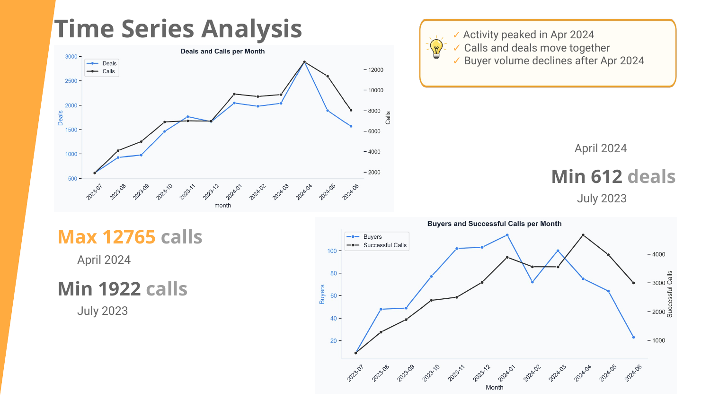
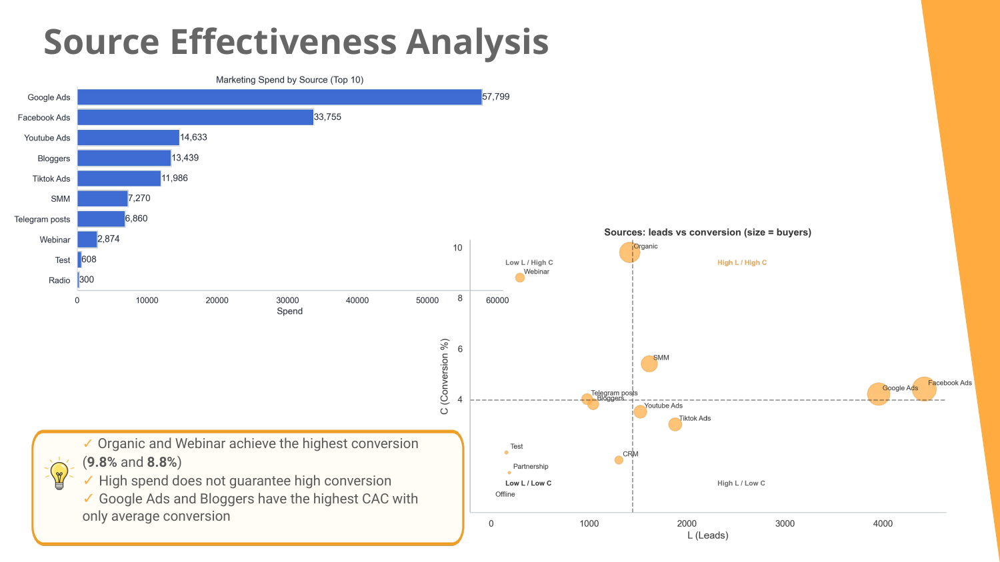
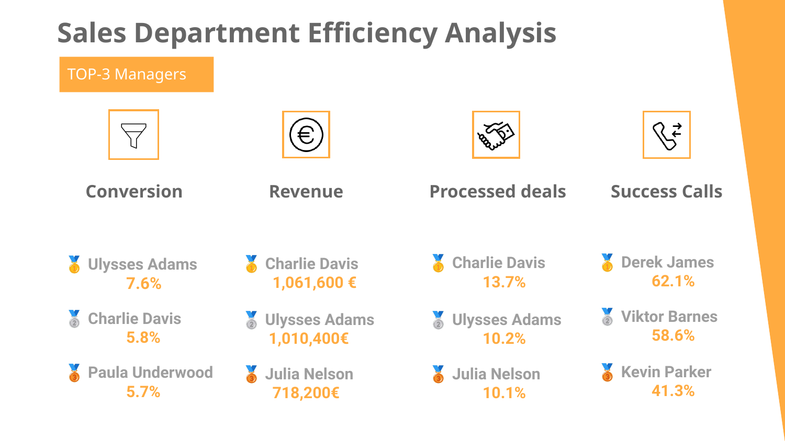
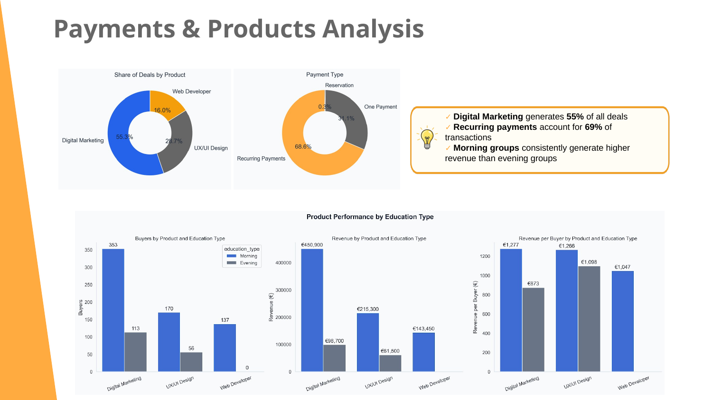

# CRM Sales & Marketing Analysis | Python & SQL

## Project Overview

This portfolio project presents an end-to-end analysis of CRM data for an online programming school.

The project combines data cleaning, exploratory analysis, sales and marketing analytics, product performance, unit economics, and experiment design — implemented primarily in Python, with a SQL layer built on top of the same cleaned dataset to demonstrate key business questions solved with joins, CTEs, and window functions.

The main goal is to transform raw CRM records into business insights that can support decisions across the customer acquisition and sales funnel.

### Main Data Areas

- Contacts
- Calls
- Marketing Spend
- Deals
- Buyers
- Products & Payments

> **Data privacy:** the original CRM files are not included in this public repository. The notebooks document the full cleaning and analytical workflow.

---

## Tech Stack

**Python** • **Pandas** • **NumPy** • **Matplotlib** • **Seaborn** • **Statsmodels** • **Jupyter Notebook** • **PostgreSQL** • **SQLAlchemy**

Key skills demonstrated:

- data cleaning and validation
- missing-value and duplicate handling
- reusable Python helper functions
- descriptive statistics
- time-series analysis
- funnel and conversion analysis
- marketing-source and campaign analysis
- sales-team performance analysis
- product and payment analysis
- unit economics
- sensitivity analysis
- A/B test design and power analysis
- SQL: joins, common table expressions (CTEs), window functions, cohort analysis

---

## Project Workflow

```text
Raw CRM Data
│
├── Contacts
├── Calls
├── Marketing Spend
└── Deals
     │
     ▼
Data Cleaning & Validation
     │
     ▼
Processed CRM Tables
     │
     ├── Descriptive Statistics
     ├── Time-Series Analysis
     ├── Marketing Effectiveness
     ├── Sales-Team Performance
     ├── Payments & Products
     ├── Geographic Analysis
     ├── Unit Economics & Experiments
     └── SQL Layer (joins, CTEs, window functions, cohort analysis)
```

---

## Key Business KPIs

| KPI | Result |
|---|---:|
| Unique Leads | **17,005** |
| Confirmed Buyers | **836** |
| Lead → Buyer Conversion | **4.92%** |
| Customer Acquisition Cost | **~€179** |
| Average Value per Estimated Payment Event | **~€921** |
| Estimated Customer Lifetime Value | **~€4,499** |
| Estimated CLTV / CAC | **~25.2×** |
| Estimated Contribution Margin | **~€3.61M** |

> Revenue, CLTV, product-level CAC, and contribution margin are CRM-based analytical estimates. The assumptions used in these calculations are documented in Notebook 12.

---

## 1. Data Preparation

The project starts by cleaning and standardizing four CRM source tables.

The cleaning workflow includes:

- converting column names to `snake_case`
- removing duplicate CRM records
- resolving duplicated contact IDs
- parsing date and numeric fields
- handling missing values
- checking chronological inconsistencies
- standardizing categorical fields
- creating analytical flags such as buyer status and successful calls

A reusable `helpers.py` module contains common inspection, descriptive-statistics, and visualization functions.

The processed data is then used by the analytical notebooks, and separately exported to CSV for the SQL layer (see Section 12).

---

## 2. Descriptive Statistics



The initial analysis provides a broad view of CRM activity.

Selected findings from the project presentation include:

- **90.5%** of calls were outbound
- median call duration was **9 seconds**
- approximately **21%** of calls were unanswered
- the top five managers handled **46%** of contacts
- marketing generated approximately **51M impressions** and **498K clicks**
- **70.6%** of deals were lost
- median first-response SLA was approximately **5.5 hours**

These results indicate potential issues in both lead quality and contact efficiency.

---

## 3. Time-Series Analysis



The time-series analysis compares deals, calls, buyers, and successful calls over time.

### Key Findings

- CRM activity increased substantially over the analyzed period.
- Deals and calls moved together, indicating a strong relationship between lead-processing workload and calling activity.
- Activity peaked in **April 2024**.
- Buyer volume declined after the April peak despite continued sales activity.
- Won deals required substantially more time to close than lost deals.

Observed deal-closing behavior:

- median Won deal duration: **17 days**
- 75% of Won deals closed within approximately **42 days**
- Lost deals were typically identified much earlier

This sales-cycle length becomes important later when evaluating experiment duration.

---

## 4. Marketing Effectiveness



Marketing performance was evaluated across sources and campaigns using lead volume, buyer volume, conversion, spend, and acquisition-cost metrics.

### Key Findings

- High advertising spend does **not** automatically produce high conversion.
- Organic and Webinar traffic showed strong observed conversion.
- Some high-spend sources produced only average conversion and relatively high CAC.
- Campaigns with the highest conversion were not always the campaigns with the largest scale.

One example of this trade-off:

- a large performance campaign generated **2,471 leads** at approximately **4.4% conversion**
- a brand-search campaign reached approximately **9.4% conversion**, but on only **159 leads**

This illustrates why campaign evaluation should consider **scale and efficiency together**.

---

## 5. Sales-Team Performance



Sales-team analysis compares managers across:

- lead volume
- conversion
- realized revenue proxy
- potential contract value
- call volume
- call success
- lost-deal reasons

### Key Findings

- Workload is concentrated among a subset of managers.
- Some managers perform strongly across volume, conversion, and revenue, while others specialize primarily in call activity.
- A large share of lost deals is connected with unsuccessful customer contact.

Common loss reasons include:

- Doesn't Answer
- Stopped Answering
- Invalid Number
- Non Target
- Changed Decision

This suggests that both **lead quality** and **communication effectiveness** are important sales-funnel constraints.

---

## 6. Payments & Product Performance



The analysis explores payment behavior, product mix, and education format.

### Key Findings

- Recurring payments are the dominant payment option among confirmed buyers.
- Digital Marketing generates the largest buyer volume.
- Morning groups generate substantially more buyer volume and recorded revenue than Evening groups.
- Payment preferences differ by product.
- Higher-priced programs are more frequently associated with recurring payments.

Because payment and education fields are most complete at later funnel stages, these comparisons are treated as descriptive rather than causal.

---

## 7. Geographic Analysis

The geographic analysis examines deal volume and observed conversion across German cities and recorded language levels.

### Key Findings

- Demand is concentrated in major cities.
- Berlin has the highest observed deal volume.
- A long tail of smaller cities contributes relatively few deals individually.
- Observed conversion differs by recorded German-language level.

Language-related findings are interpreted cautiously because language level may be incomplete, selectively recorded, and correlated with other customer characteristics.

---

## 8. Unit Economics

Notebook 12 combines marketing cost, buyer behavior, course duration, and payment assumptions to estimate unit economics.

### Overall Results

- **C1:** 4.92%
- **CAC:** ~€179
- **Estimated CLTV:** ~€4,499
- **CLTV/CAC:** ~25.2×
- **Estimated Contribution Margin:** ~€3.61M

### Product-Level Pattern

| Product | Estimated Attributed Budget | Buyers | Estimated CAC |
|---|---:|---:|---:|
| Digital Marketing | ~€95.6K | 473 | ~€202 |
| UX/UI Design | ~€38.2K | 226 | ~€169 |
| Web Developer | ~€15.7K | 137 | ~€115 |

Marketing spend is attributed to products using a documented proportional-attribution heuristic because the CRM does not provide reliable product-level acquisition cost for every lead.

---

## 9. Growth-Lever Sensitivity

Several unit-economics levers were modeled:

- Unique Leads (UA)
- Lead → Buyer Conversion (C1)
- Average Purchase Count (APC)
- Average Order Value (AOV)
- Acquisition Cost

In the scenario analysis, **conversion improvement (C1)** produced the strongest contribution-margin increase.

A modeled `C1 +15%` scenario increased estimated contribution margin by approximately **€559K**.

The next step was therefore to investigate an operational factor that may influence conversion: **first-response time (SLA)**.

---

## 10. SLA Diagnostic & Experiment Design

Historical CRM data shows an association between response speed and funnel outcomes.

### Lead → Buyer Conversion by SLA Quartile

| SLA Group | Median SLA | Conversion |
|---|---:|---:|
| Fastest | 27 min | **6.21%** |
| Fast | 164 min | 5.36% |
| Slow | 722 min | 5.42% |
| Slowest | 1,376 min | **4.64%** |

The project then uses **Contact Success Rate** as a shorter-cycle operational metric because the median Won deal takes about 17 days to close.

### Statistical Feasibility

For a Contact Success Rate improvement from approximately **56.7% to 65.3%**:

- significance level: **α = 0.05**
- statistical power: **80%**
- required sample: **532 leads per group** (1,064 total)
- estimated recruitment time: approximately **29 days**

A strict **14-day** test can only reliably detect a larger effect of roughly **+12.4 percentage points** (n=256/group) at the observed lead flow.

This is an important analytical conclusion: a short experiment may be operationally possible but statistically underpowered for the more realistic historical effect.

---

## 11. Demo Funnel Diagnostic

The analysis also identified a weak Demo → Buyer path:

- unique demo contacts: **791**
- later confirmed buyers: **10**
- observed Demo → Buyer Conversion: **1.26%**

A structured follow-up process is a plausible business hypothesis. A two-group power calculation for approximately **1.26% → 10%** requires around **27 contacts per group** (54 total), which is reachable in roughly **25 days** at the observed demo flow (~2.24 demo contacts/day).

Because the baseline rate is very low, evaluating the actual test results should rely on an exact test (e.g., Fisher's exact test) rather than a standard normal approximation.

---

## 12. SQL Layer

To complement the pandas-based analysis, a set of PostgreSQL queries was built on top of the same cleaned CRM tables — reproducing key business questions with joins and CTEs, and extending the analysis with window functions and a cohort-retention view not covered by the notebooks.

| Query | Business Question | Technique |
|---|---|---|
| `01_funnel_and_conversion.sql` | Which sources generate the most leads and buyers, and which convert most efficiently? | CTE, `LEFT JOIN`, `COALESCE` |
| `02_sla_response_time.sql` | Does faster first response correlate with higher conversion? | CTE with a join-time condition, `EXTRACT(EPOCH ...)`, `NTILE()` |
| `03_manager_revenue_ranking.sql` | Which managers lead in revenue each month? | `RANK() OVER (PARTITION BY ...)` |
| `04_cohort_retention.sql` | For leads grouped by their first-appearance month, what share eventually buy, and how long does it take? | CTE, `DATE_TRUNC`, `AGE()` |

Results were cross-checked against the pandas notebooks — for example, source-level conversion figures (Organic 9.8%, Facebook Ads 4,423 leads) and the direction of the SLA-conversion relationship both matched independently of the calculation method.

See [`sql/sql_README.md`](sql/sql_README.md) for full query documentation, results, and setup instructions.

---

## Business Recommendations

1. **Improve first-response time**
   - prioritize new leads
   - monitor Contact Success Rate
   - evaluate downstream conversion after the sales cycle matures

2. **Improve lead quality**
   - investigate high shares of Non Target and Invalid Number leads
   - evaluate acquisition sources by both scale and conversion

3. **Optimize marketing allocation**
   - do not evaluate channels on spend or lead count alone
   - combine conversion, buyer volume, and CAC

4. **Optimize Digital Marketing acquisition cost**
   - it is the largest product and consumes the largest estimated acquisition budget

5. **Explore retention / upsell for Web Developer**
   - CAC is low, but estimated customer value is limited by the shorter course duration

6. **Run the Demo follow-up test**
   - the required sample size is reachable within roughly 25 days at current demo traffic

---

## Notebook Guide

| Notebook | Purpose |
|---|---|
| `01_contacts_cleaning.ipynb` | Clean Contacts and resolve duplicate IDs |
| `02_calls_cleaning.ipynb` | Clean Calls and create call-success flag |
| `03_marketing_spend_cleaning.ipynb` | Clean advertising spend data |
| `04_deals_cleaning.ipynb` | Clean Deals and create analytical deal fields |
| `05_buyers_preparation.ipynb` | Build the confirmed-buyer dataset |
| `06_descriptive_statistics.ipynb` | Explore CRM structure and distributions |
| `07_time_series_analysis.ipynb` | Analyze temporal trends and deal duration |
| `08_marketing_effectiveness.ipynb` | Compare sources and campaigns |
| `09_sales_team_performance.ipynb` | Evaluate manager and call performance |
| `10_payments_products_analysis.ipynb` | Analyze payments, products, and education formats |
| `11_geographic_analysis.ipynb` | Analyze cities and recorded language levels |
| `12_unit_economics_experiments.ipynb` | Unit economics, sensitivity, hypotheses, and experiment design |

---

## Repository Structure

```text
crm-sales-marketing-analysis-python/
│
├── README.md
├── helpers.py
├── requirements.txt
├── .gitignore
│
├── data/
│   └── README.md
│
├── images/
│   ├── descriptive_statistics.png
│   ├── time_series.png
│   ├── source_effectiveness.png
│   ├── sales_team.png
│   └── payments_products.png
│
├── notebooks/
│   ├── 01_contacts_cleaning.ipynb
│   ├── 02_calls_cleaning.ipynb
│   ├── 03_marketing_spend_cleaning.ipynb
│   ├── 04_deals_cleaning.ipynb
│   ├── 05_buyers_preparation.ipynb
│   ├── 06_descriptive_statistics.ipynb
│   ├── 07_time_series_analysis.ipynb
│   ├── 08_marketing_effectiveness.ipynb
│   ├── 09_sales_team_performance.ipynb
│   ├── 10_payments_products_analysis.ipynb
│   ├── 11_geographic_analysis.ipynb
│   └── 12_unit_economics_experiments.ipynb
│
└── sql/
    ├── README.md
    └── queries/
        ├── 01_funnel_and_conversion.sql
        ├── 02_sla_response_time.sql
        ├── 03_manager_revenue_ranking.sql
        └── 04_cohort_retention.sql
```

---

## About

This project was developed as part of Data Analytics training and demonstrates practical work with CRM data, Python and SQL analytics, business metrics, unit economics, and experiment design.
